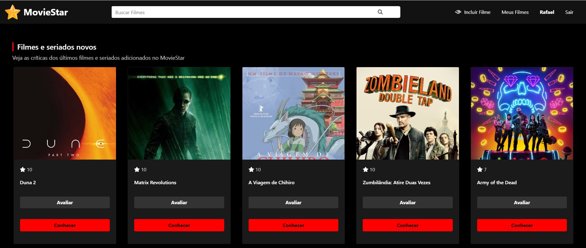

<h1 align="center">
<p ><b> MOVIE STAR 🍿💫</b> <br> <p style="font-size: 15px">Seu site de catalogo de filmes e séries.</p></p>


<br>
</h1>


<a href="https://abrir.link/Vnvhm" style="text-decoration: none; color: #007bff;">
🚀 Para explorar o site, clique aqui!</h2>
</a>


## ✨ Sobre

### Este site é um catálogo de filmes e séries online desenvolvido para atender às suas preferências e proporcionar uma experiência imersiva na busca por conteúdos audiovisuais. Construído com base nos dados que você fornecer, ele oferece uma interface atrativa e repleta de funcionalidades para ajudá-lo a encontrar o que deseja assistir.


## 🔨 Ferramentas

- [HTML5](https://www.w3schools.com/html/)

- [CSS3](https://www.w3schools.com/css/)
  - Estilizacao
- [PHP](https://www.w3schools.com/php/)
  - Variáveis
  - Estruturas Condicionais
  - Laços de Repetição
  - Funções
  - Arrays
  - Conexão com Banco de Dados
  - Sessões
  - Segurança
- [MYSQL](https://www.w3schools.com/mysql/)
  - Consultas SQL

## 🎬  Funcionalidades

- **Pesquisa Avançada:** Encontre filmes e séries por título, gênero, ano de lançamento, classificação etária, diretor, elenco, palavras-chave e outros critérios personalizáveis.

- **Filtros Refinados:** Utilize filtros para restringir os resultados da pesquisa de acordo com suas preferências específicas, como idioma do áudio original, país de origem e duração.

- **Detalhes Completos:** Acesse páginas dedicadas a cada filme e série, repletas de informações valiosas, incluindo sinopse, trailer, elenco completo, equipe técnica, avaliações de usuários, críticas especializadas e links para assistir online (quando disponíveis legalmente).

- **Classificação Etária:** Visualize rapidamente a classificação etária de cada título por meio de ícones coloridos, auxiliando na tomada de decisões informadas sobre o conteúdo adequado para você e sua família.

- **Avaliação de Usuários:** Contribua para a comunidade avaliando os filmes e séries que assistiu, ajudando outros usuários a descobrir conteúdos de qualidade.

- **Comentários:** Compartilhe suas impressões e opiniões sobre filmes e séries através de um sistema de comentários, fomentando discussões e engajamento entre a comunidade.

- **Recomendações Personalizadas:** Com base em seus gostos e avaliações anteriores, o site sugere filmes e séries que você provavelmente irá gostar, auxiliando na descoberta de novos conteúdos.

- **Listas Personalizadas:** Crie e organize listas de filmes e séries que deseja assistir posteriormente ou que já assistiu e deseja revisitá-los. Essas listas podem ser públicas ou privadas, de acordo com sua preferência.

- **Integração com Redes Sociais:** Compartilhe facilmente filmes e séries que você gosta com seus amigos e familiares através de redes sociais como Facebook, Twitter e Instagram.

- **Informações Adicionais:** O rodapé do site oferece informações sobre o autor do catálogo e seus links de contato, permitindo que usuários entrem em contato para sugestões ou feedback.

- **Acessibilidade:** O layout do site é desenvolvido pensando na acessibilidade, garantindo uma experiência de usuário positiva para todos, independentemente de suas habilidades.

## 👤 Funcionalidades do Usuário Logado:

- **Alteração de Foto de Perfil:** O usuário pode personalizar seu perfil alterando sua foto.

- **Atualização de Dados Cadastrais:** Permite que o usuário modifique suas informações de perfil, como nome, e-mail e data de nascimento.

- **Gerenciamento de Listas:** Crie, edite e exclua listas de filmes e séries de acordo com seus interesses.

- **Avaliação de Conteúdos:** Avalie os filmes e séries que assistiu, contribuindo para a comunidade do site.

- **Comentários e Discussões:** Compartilhe suas impressões sobre filmes e séries, participe de debates e interaja com outros usuários.

- **Acesso a Recomendações:** Receba sugestões personalizadas de filmes e séries com base em seus gostos e avaliações.

- **Histórico de Assistidos:** Acompanhe os filmes e séries que você já assistiu, facilitando a revisão de seus favoritos.

## ♻️ Como contribuir para este projeto

```bash
# Clone o projeto
$ git clone https://github.com/rafaelbcabral/agenda-telefonica.git
````
<br>

````bash
# Entrar no diretório
$ cd agenda-telefonica
````
<br>

````bash
# Instalar as dependencias, caso use npm
$ npm install
````

<p style="text-align: center; font-size: 15px; "><b>OR</b></p>

````bash
# Caso use Yarn
$ yarn
````

<h1></h1>
<p style="text-align: center; font-weight: bold; font-size: 20px">End</p>
